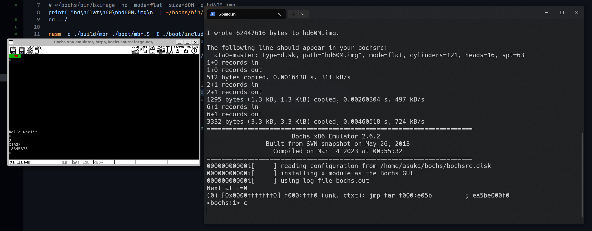

由于原书的 gcc 版本太低导致 elf 文件结构差异巨大，故需要使用低版本 gcc 编译，经过搜索得知 gcc4.4 可用，于是起了个虚拟机装 gcc4.4 在里面编译
- 还在研究怎么通过 ssh 自动化编译
```shell
gcc -o ./build/main.o -c -m32 -I ./lib/kernel/ ./kernel/main.c
nasm -f elf -o ./build/print.o ./lib/kernel/print.S
ld -m elf_i386 -Ttext 0x00001500 -e main -o ./build/kernel.bin  ./build/main.o
```
编译完将`kernel.bin`扔进`build`目录

```shell
./build.sh
```
