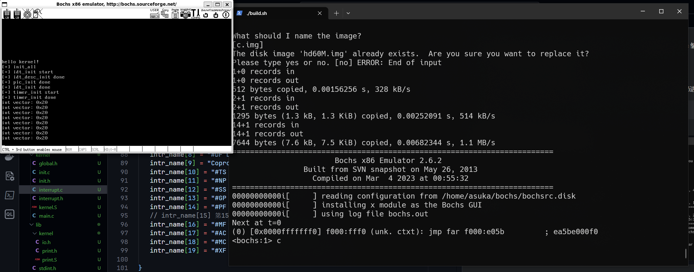

由于原书的 gcc 版本太低导致 elf 文件结构差异巨大，故需要使用低版本 gcc 编译，经过搜索得知 gcc4.4 可用，于是起了个虚拟机装 gcc4.4 在里面编译
- 还在研究怎么通过 ssh 自动化编译

先在有 gcc4.4 的环境下运行`build.sh`中注释指定部分，编译完将`kernel.bin`扔进`build`目录

```shell
./build.sh
```
由于 timer 设置的频率为 100Hz，实际运行效果其实只能看到时钟中断信息，此图纯靠手速截得（）
