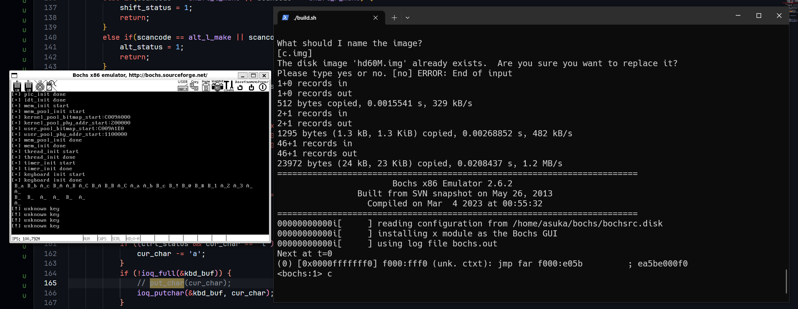

由于原书的 gcc 版本太低导致 elf 文件结构差异巨大，故需要使用低版本 gcc 编译，经过搜索得知 gcc4.4 可用，于是起了个虚拟机装 gcc4.4 在里面编译
- 还在研究怎么通过 ssh 自动化编译


在有 gcc4.4 的环境下
```shell
make all
```
将生成的`build`目录移动到 bochs 工作环境

```shell
./build.sh
```
美观起见`/device/keyboard.c`中的键盘中断处理函数注释掉了输出字符`put_chr(cur_char)`，由缓冲区消费者自行调用输出

上图展示了以下输入反馈：
- 小写字母
- shift 转大写字母
- CapsLock 转大写字母
- shift + CapsLock 转小写字母
- 数字
- shift 转符号
- 空格、换行及回退
- 未定义字符