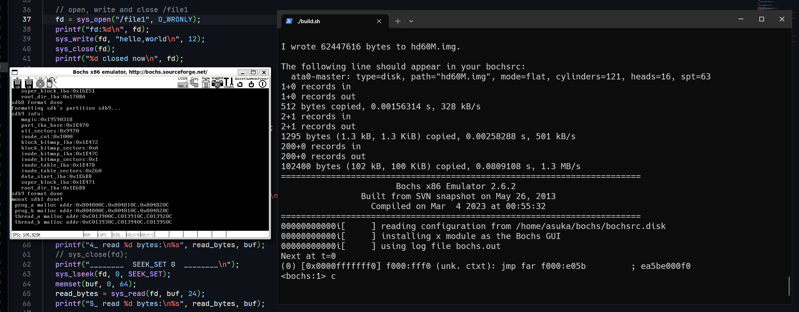
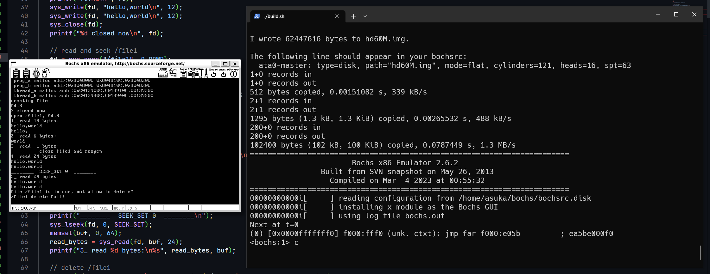
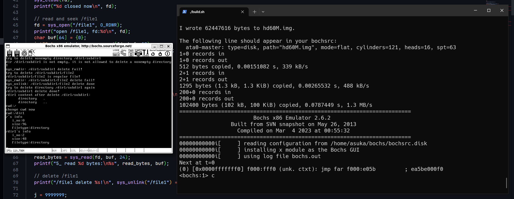

由于原书的 gcc 版本太低导致 elf 文件结构差异巨大，故需要使用低版本 gcc 编译，经过搜索得知 gcc4.4 可用，于是起了个虚拟机装 gcc4.4 在里面编译
- 还在研究怎么通过 ssh 自动化编译

硬盘镜像文件可以直接取主目录下的`hd80M.img`，如果想自行分区可以参考这篇博客
- https://blog.csdn.net/kanshanxd/article/details/132026480

另外还需要在`bochsrc.disk`添上
```
ata0-slave: type=disk, path="/path/to/bochs/hd80M.img", mode=flat,cylinders=162,heads=16,spt=63
```

在有 gcc4.4 的环境下
```shell
make all
```
将生成的`build`目录移动到 bochs 工作环境

```shell
./build.sh
```

由于采取了一步到位的测试方式，这里的`main`集成了整章的功能测试（由于`build.sh`每次执行都会将新的硬盘重新拷贝至 bochs 的工作目录，这里没有测试检查硬盘中文件系统功能），中间采取自减耗时来延缓输出
- 测试`mount`和创建文件系统并打印信息

- 测试`create`、`read`、`write`、`seek`以及文件被占用情况下的`delete`

- 测试`delete`、`mkdir`、`rm`、`cd`、`pwd`和`stat`
